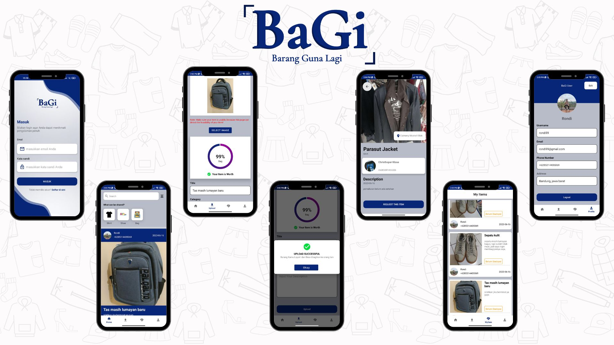

# Mobile Development Project For BaGi Apps

## Design Prototype
Before entering the code implementation process, we designed the UI of the application using [Figma](https://www.figma.com/) which is a prototyping tools application.

Here is the [link](https://www.figma.com/file/xf3di0LjCCK8i4BSciFJ4e/BaGi?type=design&node-id=0%3A1&t=bYMM8hLaSwN5j5Se-1) to our design prototype.

## Code Implementation
The BaGi(Barang Guna Lagi) application was developed using the Kotlin Native Programming Language. This app is designed to share used goods locally (currently in Jakarta). This application allows users to share used goods such as shoes, bags and clothes, and can detect the appropriateness of the goods shared by users using Image Classification and Image Detection from Machine Learning which we process with TensorFlow Lite. We implemented MVVM with the Repository pattern, used LiveData to flow data from resources to the UI, and used CameraX to build the built-in camera app used for detection.

## Libraries

Here are some libraries that we use on this project.
| Library                  | Version |
| :----------------------- | :-----: |
| Retrofit2                | [2.9.0](https://square.github.io/retrofit/) |
| CameraX                  | [1.2.2](https://developer.android.com/training/camerax) |
| TensorFlow Lite          | [0.1.0](https://www.tensorflow.org/lite) |
| Dagger-Hilt              | [2.41](https://dagger.dev/hilt/) |
| Datastore                | [1.0.0](https://developer.android.com/topic/libraries/architecture/datastore) |
| Glide                    | [4.13.1](https://bumptech.github.io/glide/) |
| View Model               | [2.6.1]
| Live Data                | [2.6.2]
| ViewPager2               | [1.0.0]
| Rounded Image            | [2.3.0](https://github.com/hdodenhof/CircleImageView) |
| Coroutines               | [2.4.1](https://developer.android.com/kotlin/coroutines?gclid=CjwKCAjwkYGVBhArEiwA4sZLuJ-c3uxtAZaJLTKbnsCQgo3s83EnCxf7NwW34fdGDRYXCcZWP3XBeRoCNcwQAvD_BwE&gclsrc=aw.ds) |

## Data Source

- <b>BaGi API</b>
  > https://apps-bagi-m55ykjfk2a-et.a.run.app/

## Preview 

  

